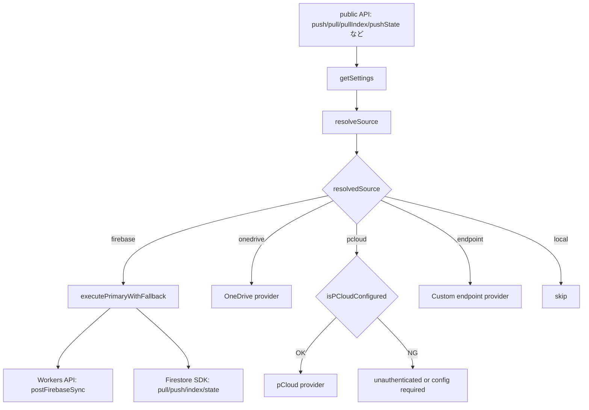

# CloudSync 機能マップ / 分割設計メモ

本ドキュメントは `assets/cloudSync.js` の関数を機能単位で分類し、
`executePrimaryWithFallback` を基準としたプロバイダインターフェース、
およびプロバイダ解決層（`resolveSource` / `isPCloudConfigured`）の呼び出し順序を整理する。

## 1. 関数分類

### 共通ユーティリティ
- `constructor(storage)`
- `resolveSource(source, settings)`
- `isPCloudConfigured(settings)`
- `getSettings(source)`
- `getUserIdOrThrow()`
- `getFirebaseSyncEndpoint(settings)`
- `buildFirebaseSyncUrl(endpoint, path)`
- `getFirebaseIdToken()`
- `normalizeCloudState(state, updatedAt)`
- `executePrimaryWithFallback(primaryTask, fallbackTask, label)`
- `buildHeaders(apiKey)`
- `buildAuthHeader(apiKey)`

### Workers API
- `postFirebaseSync(path, payload, settings)`

### Firestore SDK
- `pushToFirebase(settings)`
- `pullFromFirebase(settings, { merge })`
- `pullBookDataFirestore(bookId)`
- `pushBookDataFirestore(bookId, payload)`
- `pullIndexFirestore()`
- `pushIndexDeltaFirestore(indexDelta, updatedAt)`
- `matchBookFirestore(fingerprint, meta)`

### OneDrive
- `pushToOneDrive(settings)`
- `pullFromOneDrive(settings, { merge })`
- `ensureOneDriveToken(settings)`
- `encodeOneDrivePath(path)`
- `buildOneDrivePath(settings)`
- `buildOneDriveContentUrl(settings)`
- `resolveOneDriveItem(accessToken, settings)`
- `uploadToOneDrive(accessToken, payload, settings)`

### pCloud
- `pushToPCloud(settings)`
- `pullFromPCloud(settings, { merge })`

> 参考: `pushToEndpoint` / `pullFromEndpoint` は「カスタムエンドポイント」扱いのため、
> 本分類では共通ユーティリティに準拠する補助カテゴリとして整理する。

## 2. プロバイダインターフェース（push/pull/state/index）

`executePrimaryWithFallback` に合わせた分割方針として、
「プライマリ（Workers API）」と「フォールバック（Firestore SDK）」が
同じ入力/出力の形を持つことを前提に整理する。

### 2.1 インターフェース定義（概念）

- `push(settings): Promise<{ source, status? } | object>`
  - 役割: スナップショットの保存
- `pull(settings, { merge }): Promise<{ source, status? } | object>`
  - 役割: スナップショットの取得と必要に応じた `merge`
- `state`
  - `pullState(cloudBookId, settings): Promise<object | { source, status }>`
  - `pushState(cloudBookId, state, updatedAt, settings): Promise<object | { source, status }>`
- `index`
  - `pullIndex(settings): Promise<object | { source, status }>`
  - `pushIndexDelta(indexDelta, updatedAt, settings): Promise<object | { source, status }>`

> `executePrimaryWithFallback` を利用するのは **index / state**。
> push/pull は各プロバイダが単独実装で返却する（現状は Firebase/OneDrive/pCloud/Endpoint）。

### 2.2 プロバイダ別の入力/出力まとめ

#### Workers API（Firebase Workers）
- **入力**
  - `path`: `/sync/index/pull` / `/sync/index/push` / `/sync/state/pull` / `/sync/state/push`
  - `payload`: `idToken` + API 依存のパラメータ
    - index pull: `{ since }`
    - index push: `{ indexDelta, updatedAt }`
    - state pull: `{ cloudBookId }`
    - state push: `{ cloudBookId, state, updatedAt }`
- **出力**
  - `response.json()` の `data` が存在すれば `data`、無ければレスポンス全体

#### Firestore SDK
- **入力**
  - `pushToFirebase`: `settings`（実際には `storage.snapshot()` を送る）
  - `pullFromFirebase`: `settings`, `{ merge }`
  - `pullIndexFirestore`: なし（`uid` と固定パスで読み込み）
  - `pushIndexDeltaFirestore`: `indexDelta`, `updatedAt`
  - `pullBookDataFirestore`: `bookId`
  - `pushBookDataFirestore`: `bookId`, `payload`
- **出力**
  - index/state は Firestore の document data または `{ status, source }`
  - `pullFromFirebase` は `{ data, updatedAt, ... }` などの document data

#### OneDrive
- **入力**
  - `pushToOneDrive`: `settings`（アクセストークン + ファイルパス/ID）
  - `pullFromOneDrive`: `settings`, `{ merge }`
- **出力**
  - `pushToOneDrive`: `{ source: "onedrive", fileId }`
  - `pullFromOneDrive`: ファイル内容 JSON

#### pCloud
- **入力**
  - `pushToPCloud`: `settings`（`endpoint`, `apiKey`）
  - `pullFromPCloud`: `settings`, `{ merge }`
- **出力**
  - `pushToPCloud`: レスポンス JSON（失敗時は例外）
  - `pullFromPCloud`: レスポンス JSON / `{ source: "pcloud", status: "not_found" }`

#### Endpoint（参考）
- **入力**
  - `pushToEndpoint`: `settings`（`endpoint`, `apiKey`）
  - `pullFromEndpoint`: `settings`, `{ merge }`
- **出力**
  - レスポンス JSON（`data` がある場合は `merge`）

## 3. プロバイダ解決層と呼び出し順序

### 3.1 解決層の役割
- `resolveSource`:
  - ユーザー指定 / 設定値 / 旧エイリアス / デフォルト値を統一し、
    **許可されたソース**へ正規化する。
- `isPCloudConfigured`:
  - `pcloud` を選択した際に **最小限の設定（endpoint + apiKey）** を満たしているか検証する。

### 3.2 分割後の呼び出し順序（図示）

> 分割後は「解決層（resolveSource / isPCloudConfigured）」→「プロバイダ本体」→
> 「Workers/SDK など実体」 の順序が明示される。

